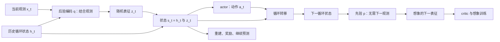

# Dreamer 路线：动力学如何服务于决策

## 路线总览

这条路线追问：**模型已经能够预测下一步，怎样让这种预测改善行动？** Dreamer 的答案是把环境经验压缩成可滚动的状态，在模型内生成未来，再用这些未来训练策略。世界模型负责“执行动作后可能出现什么”，价值模型负责“这些结果有多好”，策略负责选择动作；三者共同形成决策系统。[初代 Dreamer](https://arxiv.org/pdf/1912.01603v3)建立潜在想象中的行为学习框架，[DreamerV3](https://www.nature.com/articles/s41586-025-08744-2)着重训练稳定性，[Dreamer4](https://arxiv.org/pdf/2509.24527v1)展示离线数据与更可扩展动力学下的想象训练。

这里的“想象”是模型生成的状态轨迹，不是 LLM 写出的推理文字。训练策略也不要求模型先恢复每一帧图像：解码器可以用于训练表征和检查预测，控制过程可以直接消费压缩状态。理解这条路线最有用的区分是：**世界模型的预测质量、模型内策略收益、真实环境中的执行收益，是三个需要分别验证的对象。**

### 总体机制


图中的模型内循环可以反复运行；真实执行仍要单独评估。初代 Dreamer 和 V3 训练时继续采集环境经验，V4 的主要 Minecraft 实验使用固定离线数据，训练阶段没有图中的真实反馈回路。初代与 V3 行动时直接从 actor 采样动作，不进行在线前瞻搜索；“在模型里训练策略”与“每一步部署时搜索行动树”是不同实现。[初代，§3 / Algorithm 1](https://arxiv.org/html/1912.01603v3#S3)、[V3，Learning algorithm / Critic learning](https://www.nature.com/articles/s41586-025-08744-2)、[V4，Algorithm 1 / §3.3 / §4.1](https://arxiv.org/pdf/2509.24527v1)。

| 要读懂的环节 | Dreamer（ICLR 2020） | DreamerV3 | Dreamer4 |
| --- | --- | --- | --- |
| 怎样表示当前状态 | 继承 PlaNet 的 RSSM：循环记忆与连续随机状态 | 循环状态与离散随机表征，合称 RSSM 状态 | 按时间顺序约束的连续视频 token 与 transformer 上下文 |
| 怎样模拟未来 | 无新观测时滚动 latent transition，预测奖励 | 从潜在动力学先验滚动状态，预测奖励与继续标志 | 动作条件化 shortcut forcing，逐帧生成连续表征 |
| 怎样学行为 | 有限想象接长期 value，以多步模型梯度训练 actor；在线收集数据 | 在想象轨迹上训练 actor / critic，持续在线收集数据 | 先行为克隆与奖励建模，再在固定世界模型内强化学习 |
| 最值得关注的证据 | 模型梯度、value 补全与表征目标的控制消融 | 固定算法超参数跨多类任务的稳定性 | 离线想象训练能否超越行为克隆、精细交互能否实时模拟 |

这是沿同一个问题的机制变化，不能只按模型大小理解“V3 → V4”。V4 与生成式交互模拟路线重叠；预测表征可以作为动力学系统的组成部分；结构化动力学也可以接上价值模型或控制器。本站的四个入口组织的是研究问题，不是互斥的算法类别。

### 证据边界：哪里已经回答，哪里还没有

| 看到的证据 | 合理结论 | 仍需额外验证 |
| --- | --- | --- |
| 多步预测与原环境轨迹吻合 | 在相应数据分布及动作范围内，模型抓住了部分动力学 | 策略主动选择的新动作组合是否仍准确 |
| 想象训练优于同系统的行为克隆 | 模型生成的训练经验能改善该实验条件下的策略 | 改善是否跨环境、负载、故障与训练种子稳定 |
| 共享超参数在多域表现好 | 训练配方较稳健 | 同一个训练好的模型是否能直接迁移到新系统 |
| 输入动作后生成不同结果 | 模型具备动作条件化预测能力 | 干预效应是否可识别、混杂因素是否被控制 |

最后一行对 IT 场景尤其关键。历史运维动作往往由故障严重度、负载和操作者判断共同决定；训练得到的 `p(未来状态 | 历史, 动作)` 不会自动成为 `p(未来状态 | do(动作), 历史)`。这是一项迁移分析：Dreamer 的控制成绩没有代替生产系统中的干预识别与执行验证。

### 阅读顺序

1. 先读下方 [**Dreamer（ICLR 2020）**](#paper-dreamer)：从原始算法理解状态与参数、观测更新与无观测推演，以及 actor / critic、重参数化和 λ-return。重点看 §2–4、Algorithm 1。
2. 再读 [**DreamerV3**](#paper-dreamerv3)：看同一框架如何提高训练稳定性。重点看 Nature 图 1、Learning algorithm 和消融。
3. 再读 [**Dreamer4**](#paper-dreamer4)：重点对照其算法 1、图 2、图 3 / 4 与表 3，理解训练方式、动作空间和数据条件一起改变了什么。
4. 若仍混淆“规划”与“学策略”，按需对照 [PlaNet：Learning Latent Dynamics for Planning from Pixels](https://arxiv.org/abs/1811.04551)：它以潜在动力学在线规划为中心，初代 Dreamer 转向用潜在想象训练行为。
5. 回到生成式交互模拟、预测表征、结构化动力学路线，比较它们把误差放在哪里衡量：像素、表征、物理状态、任务收益，还是安全约束。

## Dreamer（ICLR 2020）

**学习一个可以随观测更新、也可以脱离观测向前运行的潜在状态系统，再利用其中的想象轨迹训练行动策略。**

这是 Dreamer 系列的起点：*Dream to Control: Learning Behaviors by Latent Imagination*，Danijar Hafner、Timothy Lillicrap、Jimmy Ba、Mohammad Norouzi，ICLR 2020。预印本首发于 2019-12-03；本篇按 arXiv v3（2020-03-17）整理。正文以完整学习笔记为主线，对照原论文 §2–4、Algorithm 1 和作者介绍核验，并补充实验条件与迁移边界。[原论文 v3](https://arxiv.org/pdf/1912.01603v3)、[原文 HTML](https://arxiv.org/html/1912.01603v3)、[Google Research 官方介绍](https://research.google/blog/introducing-dreamer-scalable-reinforcement-learning-using-world-models/)、[作者代码](https://github.com/danijar/dreamer)。

### 问题与贡献：怎样把预测变成更好的行为？

世界模型并非 Dreamer 首创。它用 latent state 紧凑地表示当前情况，并学习状态、动作与未来状态、奖励之间的关系。**Latent state 表示“现在是什么情况”，模型参数表示“情况如何变化”。** 状态会随这一段经验改变，参数通过训练学习可复用的规律；两者不能混为一谈。Latent state 也不是环境真实状态本身，而是模型根据观测和历史形成的内部表示。

世界模型可以以不同方式服务决策：

| 用法 | 计算放在哪里 | 实际行动时做什么 |
| --- | --- | --- |
| 在模型中训练 policy | 在想象轨迹上反复训练 actor | 由已训练的 actor 直接给出动作 |
| Online planning | 每次行动前模拟候选动作序列，比较预测回报 | 通常执行选中序列的第一个动作，得到新观测后重新规划 |

Dreamer 主要采用前者。与 PlaNet 的在线搜索相比，它把大量推演投入行为学习，实际行动时不必重新搜索大量候选序列。这种差别是**用模型训练策略**与**用模型在线搜索**，不是有无世界模型的差别。[官方介绍，Efficient Behavior Learning](https://research.google/blog/introducing-dreamer-scalable-reinforcement-learning-using-world-models/)。

有限步想象有两个难点：只计算窗口内的奖励容易短视；学到模型后，如何高效更新策略仍需专门的算法。Dreamer 的贡献是将 **critic 的长期价值预测**接到有限想象上，并把未来奖励和价值的梯度穿过模型中的状态转移，传回 actor。世界模型主体继承 PlaNet 的 RSSM，主要创新在于**如何利用世界模型学习行为的 RL 算法**。[原文 §1、§3](https://arxiv.org/html/1912.01603v3#S3)。

### §2：观测更新与无观测推演，是两个接口

论文把视觉控制建模为 POMDP：agent 看不到完整环境状态，因而要利用历史。主要实验中，动作是连续向量，观测是高维图像，奖励是标量；目标是最大化期望累计奖励。Latent state 希望吸收历史中与预测相关的信息，使预测能主要依赖当前状态和动作，而不必重新读取完整历史。具体 RSSM 使用循环记忆与随机状态，**不是只压缩单帧图像**。

原文 Eq. 1 的三个核心接口如下。这里沿用论文的符号：representation 写作 $p_\theta$，模型中的预测分布写作 $q_\theta$。

**Representation model：用新证据更新状态。**

```math
p_\theta(s_t\mid s_{t-1},a_{t-1},o_t)
```

它结合过去状态、上一步动作和新观测，推断当前状态。真实交互、回放经验时，有当前观测可以校正内部表示。

**Transition model：没有新证据时预测状态。**

```math
q_\theta(s_t\mid s_{t-1},a_{t-1})
```

它不读取将来的真实观测，只凭过去状态和动作向前运行。想象从真实经验推断出的状态开始，后续改用这个接口。

**Reward model：根据状态预测一步奖励。**

```math
q_\theta(r_t\mid s_t)
```

Reward 是某一步获得的奖励：真实交互时由环境给出，想象时由模型预测。它不等于 critic 的 value；value 是从某状态按当前 policy 继续行动的预计折扣累计回报。**Value 不是另一种“state reward”，也不是与策略无关的状态评分。** 换一个更好的 policy，同一状态的预计回报也可能改变。[原文 §2、§3，Eq. 1–2](https://arxiv.org/html/1912.01603v3#S2)。

想象可以直接执行“当前 latent state + action → 下一 latent state → 预测 reward”，不必逐步生成未来图像。图像 decoder 可以用于训练表征或检查预测；它不是行为学习循环中每一步都必须执行的环节。

### §3：短期靠模型推演，长期靠 critic

想象轨迹从回放数据中、有真实观测支持的状态出发，随后由 actor 采样动作、transition 预测下一状态、reward model 预测奖励。Actor 根据状态输出动作分布；critic 根据状态估计当前策略继续行动的回报。

**Actor 努力让回报更高；critic 努力把回报预测得更准。** Critic 并不是随意把自己的输出往大了调。它拟合随当前策略变化的回报估计，actor 则利用该估计改进行为。

只有一步奖励模型还不够：想象只能展开有限步，但动作的后果可能在很久后才出现。Dreamer 用短期模型展开和窗口后的价值估计组成训练信号，避免把有限预测窗口直接当成全部决策目标。[原文 §3，Fig. 3–4](https://arxiv.org/html/1912.01603v3#S3)。

### 重参数化：没有换分布，而是展开可微计算

连续动作的采样写成原文 Eq. 3：

```math
\begin{aligned}
a&=\tanh\!\big(\mu_\phi(s)+\sigma_\phi(s)\epsilon\big),\\
\epsilon&\sim\mathcal N(0,I).
\end{aligned}
```

网络输出高斯分布的均值和标准差。标准正态噪声经过缩放、平移，再经过 tanh，得到范围受限的动作。这与“从相应高斯分布采样，再经过 tanh”产生相同的动作分布。**重参数化没有换一种更好的动作分布，而是把采样展开成了可求导的计算。** 一次前向计算先抽噪声，反向传播使用这次已经抽到的噪声；下一次计算再抽新的噪声，因此策略仍然是随机的。

**教学算例：梯度估计为什么可能更稳定？** 设一个不带 tanh 的标量例子，$a=\mu+\epsilon$、$\epsilon\sim\mathcal N(0,1)$，奖励 $R(a)=a$，只学习均值 $\mu$。平均奖励为 $\mu$，正确的期望梯度为 1。重参数化后，每个样本对 $\mu$ 的奖励梯度也都是 1。

在 $\mu=0$ 时，不使用 baseline 的标准 REINFORCE 单样本估计是：

```math
R(a)\,\partial_\mu\log\pi_\mu(a)
=a(a-\mu)=a^2.
```

抽到 0.1，更新信号是 0.01；抽到 2，更新信号是 4。期望仍为 1，但单次结果波动很大。在这个特定例子中，REINFORCE 估计的方差为 2，路径导数估计的方差为 0。**算例解释优势机制，不代表所有问题中重参数化的方差都更小，也不是论文实验。** 实际收益还取决于目标函数、baseline、模型误差等条件。[原文 §3，Action and value models / Eq. 3](https://arxiv.org/html/1912.01603v3#S3)。

### 模型梯度：动作改变一点，预测回报怎样变？

**教学算例，非论文实验。** 假设一个简化的可微世界模型：

```math
x'=x+2a,\qquad R(x')=1-(x'-1)^2.
```

当前 $x=0$、动作 $a=0.2$，模型预测下一位置 0.4、奖励 0.64。链式法则给出：

```math
\frac{\partial R}{\partial a}
=-4(x+2a-1)=2.4.
```

动作增加 0.01，预测奖励大约增加 0.024；实际代入 $a=0.21$，奖励变为 0.6636，增加 0.0236。差异来自导数是局部一阶近似。

模型不仅输出“动作的预测奖励是多少”，作为可微函数，还让我们计算“动作改变一点，预测奖励怎样改变”。**世界模型提供动作到未来回报的变化率；重参数化提供 actor 参数到动作的变化率。两段接起来，就能根据未来回报更新 actor。** 多步想象时，这条路径穿过连续的状态转移、奖励和价值预测。

这里算的是**模型预测下的导数**，不是直接获得真实环境的导数。模型在未覆盖的状态和动作上给出错误梯度时，策略也可能沿着错误方向改进。[原文 §3，Learning objective / Eq. 7–8](https://arxiv.org/html/1912.01603v3#S3)。

### 有限想象与 λ-return：窗口结束不等于未来结束

论文比较三种回报估计：

| 估计 | 如何处理窗口后的未来 | 主要依赖 |
| --- | --- | --- |
| 窗口内奖励求和 $V_R$ | 直接忽略，不需要 critic | 窗口内模型预测；可能短视 |
| $k$-step return $V_N^k$ | 先展开若干步，再接末状态的 critic value | 已展开的模型预测与末状态价值 |
| $\lambda$-return $V_\lambda$ | 混合不同展开长度的回报估计 | 对模型展开和 critic 的依赖之间的折中 |

例如忽略折扣，两步奖励为 1、2，两步后的 critic 预测剩余回报为 7，则两步回报估计为 $1+2+7=10$。这叫 **bootstrap（自举）**：用已有的价值预测补上没有实际展开的未来。它是估计，不是已经真实获得了后面的奖励。

若一步、两步、三步估计分别为 8、10、12，取 $\lambda=0.5$，有限窗口的混合为：

```math
0.5\times8+0.25\times10+0.25\times12=9.5.
```

最后一项的权重吸收了有限窗口的剩余质量。**$\gamma$ 控制未来奖励的折扣；$\lambda$ 控制不同展开长度的混合。** 想象得短，不代表决策必须短视；关键是窗口结束时是否接上长期价值，以及这个价值是否可信。[原文 §3，Eq. 4–6、Fig. 4](https://arxiv.org/html/1912.01603v3#S3)。

### Actor / critic 更新：固定参数，不等于切断梯度

Actor 最大化想象轨迹上的 $V_\lambda$，梯度经动作、状态转移、奖励和价值预测传回 actor。Critic 把 $V_\lambda$ 当训练目标，减小自身预测与该目标之间的平方误差：预测 6、目标 9.5，就训练它向 9.5 靠近，而不是只要求输出更大。

更新 critic 时，对目标停止梯度，避免它通过修改目标来“追上自己”。更新 actor 时，则保留回报到动作的梯度路径。可以按三组参数的职责理解：

| 更新阶段 | 修改哪些参数 | 梯度怎样使用 |
| --- | --- | --- |
| 世界模型学习 | $\theta$ | 由真实经验的表征与预测损失更新模型 |
| Actor 学习 | $\phi$ | 保留经模型与 critic 对输入的导数，更新 actor |
| Critic 学习 | $\psi$ | 拟合停止梯度后的 return 目标 |

**更新 actor 时，世界模型和 critic 的参数不随 actor 优化器更新，但仍可通过它们对输入求导。固定参数不等于切断梯度。** 同样，世界模型只在这一轮行为学习中保持固定，不是整个训练过程永远不再学习。

与其他 actor–critic 方法比较时，也要避免误解。PPO、A3C 使用 REINFORCE 类梯度；DDPG、SAC 已经利用价值函数对动作的导数。Dreamer 进一步把梯度穿过学习到的状态转移，用多步想象回报训练策略。**这不是说其他方法的 Q 只包含即时奖励：Q 本身也包含未来回报。** 连续动作与连续 latent state 使用重参数化；离散动作使用 straight-through 近似。提前终止的任务还要用模型预测的折扣降低预计终止后时间步的权重。[原文 §3，Learning objective / Comparison to actor critic methods](https://arxiv.org/html/1912.01603v3#S3)。

### §4：状态保留什么，由训练目标决定

仅把观测压缩成一个向量，不足以支持行为学习。世界模型还要从历史形成状态、按动作预测状态变化，并预测奖励。论文比较三种表征学习方案，**不是要求把三个目标同时当成必备模块**：

- **Reward prediction**：任务目标直接，但有限数据、尤其稀疏奖励下，信号可能不足。
- **Reconstruction**：要求状态还能还原观测图像，以密集观测信号推动其保留环境信息；目标包含观测重建、奖励预测与 KL 正则。
- **Contrastive estimation**：比较图像—状态的正确与错误匹配，替代像素重建；既保持状态与观测的关联，也防止所有观测映射到同一状态。

KL 连接的是“看到当前观测后的状态分布”与“只凭过去状态和动作预测的状态分布”：

```math
\operatorname{KL}\!\left(
p_\theta(s_t\mid s_{t-1},a_{t-1},o_t)
\,\middle\|\,
q_\theta(s_t\mid s_{t-1},a_{t-1})
\right).
```

前者是 posterior，后者是 prior。新观测确实提供信息，所以二者不必完全相同；但 prior 必须学会预测 posterior 所形成的状态，才能支持没有未来观测的想象。论文最大化的表征目标包括负的 KL 正则项，不是鼓励这两个分布越不同越好。[原文 §4，Eq. 9–12](https://arxiv.org/html/1912.01603v3#S4)。

重建和对比匹配提供表征学习信号，行为学习仍可直接在 latent space 中运行。**Latent space 决定表示形式，训练目标决定状态保留什么。紧凑不等于有效，最终要看这些信息是否支持预测与决策。** 论文 Fig. 8 中，重建在多数任务上更好；这不意味着任何场景都应重建所有观测细节。

### Algorithm 1：真实经验与模型内学习反复闭合

先用随机行为收集种子经验，随后不断重复：

1. 从经验库采样序列，通过 representation 推断状态，更新世界模型 $\theta$。
2. 从这些状态出发，冻结本轮世界模型参数，在 latent space 中生成轨迹。
3. 计算奖励、价值与 $V_\lambda$，分别更新 actor $\phi$、critic $\psi$。
4. 回到真实环境，用新观测更新状态，由 actor 给动作；训练采集时加入探索噪声。
5. 把新交互加入经验库，下一轮继续学习世界模型和行为。

因此，完整闭环是 **真实经验 → 更新世界模型 → 想象中训练 actor/critic → 真实行动 → 新经验**。“纯粹通过 latent imagination”指行为学习使用想象轨迹，不代表整个 agent 不需要真实交互。[原文 Algorithm 1](https://arxiv.org/html/1912.01603v3#S3)。

### 训练与证据：论文实际在哪些条件下成立？

| 项目 | 原论文设置或发现 | 解读边界 |
| --- | --- | --- |
| 主实验 | DeepMind Control Suite 的 20 个视觉连续控制任务；64×64×3 图像；统一 action repeat 为 2 | 从既有工作报告图像输入非零表现的任务中选择，不是任意视觉或真实机器人任务 |
| 数据与训练 | 在线交互形成经验库；主实验用重建目标；各连续任务共享超参数 | 共享训练配方不等于一个训练好的模型直接跨任务部署 |
| 计算条件 | 每次训练用 1 张 Nvidia V100 与 10 个 CPU 核；论文报告约 3 小时 / 百万 environment steps | 作者的实验吞吐，不能视为任意硬件、IT 数据或今日实现的成本承诺 |
| 控制成绩 | Fig. 6：Dreamer 在 5×10⁶ environment steps 后跨任务平均 823；D4PG 在 10⁸ steps 内为 786；图注报告 5 个种子 | 按论文的步数与基线预算读；不能把比值普遍化为任何任务都节省 20 倍真实操作 |
| Horizon 消融 | Fig. 4 / 7：价值模型使短想象窗口下的行为更稳健；仅窗口内奖励与 PlaNet 在线搜索是对照 | 支持价值补全的作用，不是长期模型预测已无误差 |
| 表征消融 | Fig. 8：像素重建在多数任务上更好，对比目标解决约半数任务；仅奖励预测在这些实验中不足 | 是给定任务与数据条件下的证据，不是所有世界模型的统一优劣排序 |

设置与结果分别见[原文 §6、Fig. 4、6–8、Appendix A / D / E](https://arxiv.org/html/1912.01603v3#S6)。离散动作与提前终止的扩展放在 Appendix C；不能将其理解为初代 Dreamer 已完成全面 Atari 基准验证。上面的数值均为作者结果，本站未运行训练，也没有重现这些控制成绩。

### 局限与 IT 迁移：模型内的好方向，要回到现实验证

**预测误差同时影响 rollout 和梯度。** 多步模型误差会累积，actor 还可能主动选择模型乐观但缺少真实数据支持的动作。价值补全减少无限展开的需要，却引入 critic 误差；它不消除长期不确定性。

**表征需要对任务有用，未必对安全约束充分。** 重建更好是论文条件下的结果。IT 中稀有故障、配置身份、异步作业和资源约束，可能比重建常见遥测模式更重要。迁移时需要明确哪些信息不能被压缩丢失，而不是仅测向量是否紧凑。

**可微模型不意味着真实操作可微或因果已识别。** 扩容、回滚、隔离往往是离散、延迟且可能失败的操作；观察数据中的动作选择也可能被严重度等因素混杂。模型里的动作导数与 $p(\text{未来}\mid\text{历史},\text{动作})$，都不自动证明真实干预效果已可识别。

可借鉴的是分工：先从有准确时间对齐的操作轨迹建立可更新的状态，再验证允许动作的多步后果；若预测模块已经对任务有用，再决定是否需要 actor。只有 RCA 根因标签的数据，不能替代恢复动作后的状态轨迹。生产安全性仍要通过受控环境中的实际动作、失败样本和约束检查建立证据。这一节是本站迁移分析，不是原论文证明了云系统自动恢复。

### 阅读顺序与自查

先用 §2 分清 representation / transition / reward，再用 §3 串起 actor / critic、重参数化、λ-return 与梯度路径；接着读 §4 的表征目标，回到 Algorithm 1 检查何时更新参数、何时使用真实经验；最后看 horizon、表征消融和实验预算。

可以用四个问题检查是否理解：

1. 没有未来图像，模型怎样继续运行？——使用 transition 在潜在状态上推演，不必调用图像 decoder。
2. Critic 输出更大就更好吗？——它要拟合当前策略的回报估计；只有 actor 的目标是提高回报。
3. 世界模型固定时，actor 还能用它的梯度吗？——可以；不更新模型参数，与保留对输入的导数是两件事。
4. “纯想象”是否意味着没有真实交互？——不是；世界模型和经验库仍持续由真实交互更新。

接下来读 [DreamerV3](#paper-dreamerv3)，关注同一框架如何应对训练尺度与跨域稳定性；再读 [Dreamer4](#paper-dreamer4)，看动力学架构、离线数据与行为学习方式的变化。初代 Dreamer 的连续状态、梯度路径和在线采集条件，不应直接套到后续所有版本上。

## DreamerV3

把跨域稳定性做进世界模型训练。

**论文身份。** 预印本 *Mastering Diverse Domains through World Models* 首发于 2023 年 1 月 10 日；本站同时核查 arXiv v2（2024 年 4 月 17 日）与 Nature 正式版 *Mastering diverse control tasks through world models*（2025 年 4 月 2 日）。方法与实验解读以 Nature 正式版为主。“2025 Nature 论文”不意味着 DreamerV3 在 2025 年首次提出。[arXiv 版本记录](https://arxiv.org/abs/2301.04104)、[Nature 正式版](https://www.nature.com/articles/s41586-025-08744-2)。

### 它要解决的问题

模型式强化学习的困难不止是预测下一帧。观测尺度、奖励量级、动作类型、随机性与稀疏程度一变，重建、动力学、价值和策略损失的相对强度都可能失衡。DreamerV3 的主要贡献是让同一套训练配方在不同域保持有效；RSSM 与潜在想象的基本思想来自更早的 Dreamer 系列。阅读时应关注哪些稳定化手段支撑跨域结果，而不是把“世界模型 + RL”的组合本身当作全部创新。[Nature，Learning algorithm / Robust predictions](https://www.nature.com/articles/s41586-025-08744-2)。

### 机制：有观测时校正，没有观测时滚动



学习阶段，编码器把真实观测与历史状态结合，得到随机表征；动力学先验则仅靠历史与动作预测表征。预测与表征损失把两者拉近，同时用观测重建、奖励和继续标志保留有用信息。想象阶段不读取未来真实观测，而是由先验生成后续状态。actor 与 critic 在这些轨迹上学习，critic 通过自举回报估计想象窗口之外的收益。[Nature，图 1 / World model learning / Critic learning](https://www.nature.com/articles/s41586-025-08744-2)。

这也解释了模型为何不是“视频预测器外接一个策略”这么简单：表征必须同时可预测、含有控制相关信息，且误差不能在策略优化后失控。作者使用 KL balancing、free bits 与少量均匀分布混合稳定潜在学习；使用 symlog、symexp two-hot 表达跨尺度信号；再用回报分位数归一化平衡收益与探索。它们分别处理表征塌缩 / KL 尖峰、数值量级和策略目标尺度，不应被概括成一种泛泛的“归一化技巧”。[Nature，World model learning / Actor learning / Robust predictions](https://www.nature.com/articles/s41586-025-08744-2)。

### 训练数据与实验条件

V3 从在线交互收集观测、动作、奖励与终止信息，反复采样 replay buffer 并训练模型和策略。论文的跨域实验是**共享算法超参数、针对任务分别训练模型**，并非一个已经预训练好的模型同时掌握所有域。官方实现也以对应 task config 启动训练。[作者项目](https://danijar.com/project/dreamerv3/)、[官方代码与训练说明](https://github.com/danijar/dreamerv3)。

Nature 正式版覆盖八个域、超过 150 个任务，包含视觉和向量输入、离散和连续动作、密集和稀疏奖励；每个 Dreamer agent 使用一张 A100 训练。跨域汇总要结合预算看：DMLab 比较中的部分基线使用十倍交互数据；Atari100k 对 EfficientZero 的协议差异另作说明。不能把这些结果改写成“在任意任务、同等预算下都超过所有算法”。[Nature，Evaluation / Benchmarks / Methods，图 4](https://www.nature.com/articles/s41586-025-08744-2)。

Minecraft 实验不使用人类示范或自适应课程；动作空间包含抽象 crafting 动作，并加速破块。论文报告所有训练运行在一亿环境步内发现钻石，但“每次训练最终发现过”与“每个评估 episode 都成功”是两个指标。这里的环境接口也不同于 Dreamer4 的低层鼠标键盘操作。[Nature，Minecraft，图 5 / Extended Data Fig. 2](https://www.nature.com/articles/s41586-025-08744-2)。

### 主要发现该怎样读

图 4 支持的是训练配方在多类基准上的广度。图 6 的消融在 14 个任务上检查稳定化部件，并显示无监督重建信号对性能很重要；模型大小与 replay ratio 的扩展实验则主要在 Crafter 和一个 DMLab 任务上开展。它们提示扩大模型和增加训练更新能提升数据效率，但没有建立跨所有领域成立的通用 scaling law。[Nature，Ablations / Scaling properties，图 6](https://www.nature.com/articles/s41586-025-08744-2)。

### 局限与 IT 迁移

**泛化的单位是算法配方。** 固定超参数减少调参负担，但不会消除任务接口、奖励、动作与重置机制的设计工作。把论文写成“一个通用世界模型可直接接入云系统”超出了实验证据。

**可想象不等于可信。** 策略可能更频繁访问训练数据覆盖不足的状态，因而利用世界模型错误。在 IT 迁移中，应分别评估动作后指标预测、长轨迹误差和真实恢复收益；单步预测误差不能代替恢复成功率。这是机制分析，本文没有声称 V3 已在云运维中完成验证。

**数据应描述行动后的演化。** 可以把观测换成指标、日志、拓扑和配置，把动作换成扩缩容、限流或重启，把奖励换成恢复时间与资源成本；但需要保留动作时间、目标、完成状态及并发变化。公开 RCA 的根因标签只描述诊断目标，不能替代不同动作下的恢复轨迹。

**需要处理生产环境的额外条件。** 动作存在延迟与执行失败，负载和部署持续变化，系统也往往不可随意重置。合理的迁移起点是可控沙盒中的少量动作与真实反馈，再检查覆盖、漂移和不确定性；论文中的固定超参数与游戏成绩没有给出生产安全性保证。

### 建议精读顺序

先读图 1 和 World model learning，能解释“后验校正 / 先验滚动”；再读 Actor / Critic learning，解释“为什么短想象窗口仍能优化长期收益”；最后读图 4–6 和 Methods，把结果重新放回数据预算、接口与消融范围中。官方仓库是后续实验入口，本站只核验资料，没有运行作者代码，也没有声称复现。

## Dreamer4

从固定离线经验训练可执行行为。

**论文身份。** *Training Agents Inside of Scalable World Models*，Danijar Hafner、Wilson Yan、Timothy Lillicrap，arXiv:2509.24527v1，2025 年 9 月 29 日。本站读取 32 页原始 PDF；arXiv HTML 在后半部分存在转换缺失，图表和附录以 PDF 为准。[版本记录](https://arxiv.org/abs/2509.24527)、[原始 PDF](https://arxiv.org/pdf/2509.24527v1)、[作者项目](https://danijar.com/project/dreamer4/)。

### 它要解决的问题

生成视频的模型可以拥有很强视觉表现，却不一定能准确跟随连续操作，也未必快到足以训练策略。Dreamer4 同时追求三件事：压缩后的高容量动力学、少步数的逐帧交互生成，以及能超越示范行为的想象训练。它是 Dreamer 的控制目标与生成式交互模拟技术的交汇点，不应只当作 RSSM 的更大版本。[论文，§1–3](https://arxiv.org/html/2509.24527v1)。

### 机制：三阶段学习


**阶段一：建立可交互的动力学。** tokenizer 用 masked autoencoding 压缩视频，编码与解码都遵守时间顺序。这里的 causal 是时间注意力约束，不是因果效应识别。动力学 transformer 接收视频表征、动作、每帧噪声水平和采样步长，学习 shortcut forcing：将序列噪声训练与少步生成结合，在连续表征空间逐帧采样，默认每帧四次前向计算。空间 / 时间注意力分解、稀疏的长程时间层和 GQA 支撑效率。[论文，§3.1–3.2 / §3.4，图 2](https://arxiv.org/html/2509.24527v1)。

**阶段二：让模型理解任务与行为。** 加入 task token，通过策略头和奖励头学习行为克隆与奖励预测。task token 可以读取其他模态，但其他模态不能反向读取它，避免“想完成什么”直接改变动力学预测；未来变化仍应由动作驱动。这个架构限制减轻目标信息泄漏，不是对观测数据的因果识别定理。[论文，§3.3](https://arxiv.org/html/2509.24527v1)。

**阶段三：在模型内改进策略。** 从数据上下文启动想象轨迹，让策略和动力学交替生成动作与状态，以奖励头和价值头估计回报；主要设置冻结 transformer，只更新策略与价值头。PMPO 区分正、负优势来更新动作概率，并用行为先验约束策略偏移。行为先验能限制部分偏离，但不能保证离线模型在所有新轨迹上正确。[论文，Algorithm 1 / §3.3](https://arxiv.org/html/2509.24527v1)。

### 训练 / 数据：离线并不意味着没有监督

Minecraft 主要数据是 2,541 小时 VPT contractor gameplay，包含视频、鼠标键盘动作与事件标注；分辨率 360×640、帧率 20 FPS。任务与稀疏二值奖励由现有事件构造，共 20 个任务。评估时使用表 6 的线性任务提示序列引导走向钻石。作者还把均匀序列与任务相关序列各占一半：行为克隆用相关序列，动力学损失用均匀序列，防止只学成功片段而生成过度乐观的世界。[论文，§4 / §4.1，附录表 4–6](https://arxiv.org/pdf/2509.24527v1)。

“无需在线交互训练”应理解为：学习只依赖固定数据，最终策略仍在真实游戏环境中评估。它不意味着没有动作标签、奖励监督或任务分解。“只需少量动作数据”的实验是另一组动力学泛化实验，不能把其标签比例直接套到钻石成绩上。

计算成本也应分开看：论文训练模型总计约 2B 参数（tokenizer 400M、动力学 1.6B），使用 256–1,024 张 TPU-v5p；表 2 的完整模型在单张 H100 上达到 21.4 FPS。实时推理说明模型可被交互使用，并没有证明训练费用很低或普通设备具有相同速度。[论文，§4 / §4.4，表 2](https://arxiv.org/pdf/2509.24527v1)。

### 实际证据：把成绩和条件一起读

| 证据 | 原始结果与位置 | 可以支持什么 |
| --- | --- | --- |
| 离线钻石挑战 | 1,000 个随机世界、空背包、60 分钟 episode；钻石成功率 0.7%，铁镐 29.0%；§4.1、图 3、表 7 | 在固定离线数据条件下，想象训练最终可产生成功行为；长期成功率仍低 |
| 同系统行为消融 | WM+BC 的铁镐成功率 16.9%，完整 Dreamer4 为 29.0%；表 7、图 4 | 对照同一世界模型初始化，想象 RL 对后期里程碑有额外收益 |
| 少量动作标签 | 2,541 小时视频中给 100 小时动作标签，图 7 的归一化 PSNR 达 85%、SSIM 达 100%；§4.3 | 大量无动作视频可帮助动力学学习；这是预测指标，不是控制成功率 |
| 动作外推 | Nether / End 的视频在训练中可见，但动作标签被拿掉；§4.3、图 7 | 已通过无标签视频见过的场景，可接收从其他场景学到的动作条件化 |
| 人类模型内交互 | 16 个交互任务完成 14 个；§4.2、图 5、附录图 12–14 | 有能力模拟多种精细互动；没有证明完整 Minecraft 引擎等价性 |

上表数值均来自[原始 PDF](https://arxiv.org/pdf/2509.24527v1)。图 7 把“无动作训练”与“全部动作训练”作为归一化参照，85% 不等于 85% 的画面或干预被正确预测。Nether / End 实验也不是从未见过该场景的视频就直接迁移。

作者项目提供模型内交互视频，便于检查砖块放置、工具使用与界面操作。[官方展示](https://danijar.com/project/dreamer4/)。论文还用 SOAR 机器人数据展示动作条件化生成；附录 A.1 说明其 180 小时视频、7D 末端执行器相对动作与 5 FPS 的设置。该部分验证的是模型生成与交互，没有在本文中建立真实机器人策略执行的成功率结论。[论文，§4.2、图 6 / 附录 A.1](https://arxiv.org/pdf/2509.24527v1)。

### 局限：离线想象训练最难的部分仍在

**长期成功还很脆弱。** 0.7% 的钻石成功率是有价值的存在性证据，却离稳定完成长期任务有很大距离；它也提醒我们检查前期里程碑很好、末期组合失败的差异。在 IT 中，能恢复少数简单故障与稳定恢复长链故障是不同目标。

**短记忆与状态精度限制可用范围。** 作者明确指出模型还不是完整游戏克隆，主要限制包括短记忆和背包预测不精确；Minecraft 主要上下文仅 9.6 秒。推论上，跨长时间窗口保持配置、资源身份和异步作业状态，会是 IT 迁移的重要困难。[论文，§4.2 / §6](https://arxiv.org/pdf/2509.24527v1)。

**监督与任务安排贡献不可省略。** 事件奖励、相关片段筛选和预设提示链使离线数据中的学习信号更强；它并未展示无需人工任务定义就自主发现完整目标分解。V3 和 V4 的输入、动作与训练数据不同，表 3 专门列出这些差异；直接用两个版本的钻石成功率排名会混淆实验问题。[论文，§4.1 / §5，表 3–6](https://arxiv.org/pdf/2509.24527v1)。

**预测指标和交互展示覆盖不了策略风险。** FVD、PSNR、SSIM 衡量生成分布或图像相似性；短段高分不保证库存、动作前提和长期资源约束保持正确。表 2 使用连续叠加的设计消融，有利于展示整体效率提升，但不是每个部件的完整独立因子实验。这两点是对实验设计的分析，不是声称论文已观察到相应生产故障。

### 与 IT / 云系统的关系

可借鉴的是三阶段组织方式：先从广泛轨迹学习可预测状态，再用少量有明确动作和结果的数据校准控制语义，最后在模型内改进策略。对 IT 而言，“无动作视频”对应的启发是无完整操作标注的遥测历史；“有动作数据”对应准确记录的变更和执行轨迹。二者之间需要时间对齐与可观测性设计，不能只把现成游戏 token 换成日志文本就宣称迁移完成。

更适合的第一项验证是：在受控测试环境中，给模型相同历史与多个允许动作，检查其是否正确预测延迟、错误率、队列、资源成本和回滚结果，再比较策略执行收益。要特别覆盖失败操作与无效操作，避免只看成功案例。运维动作的观察关联、模型中的动作条件化、真实环境中的干预效果仍应分别报告；Dreamer4 的任务 token 隔离和生成能力不会自动解决混杂与未覆盖动作的问题。

### 建议精读顺序

先看算法 1 和图 2，还原三阶段；接着看图 3 / 4 和表 7，理解“优于 BC”究竟在哪些里程碑体现；再读图 7 的归一化定义、表 2 的计算条件、表 3 的设置差异；最后读附录任务提示链与 Discussion。本站核验了论文和官方展示，未独立运行训练、复现成功率或验证机器人控制。
