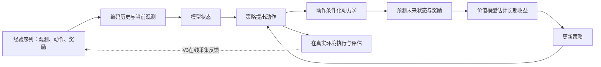
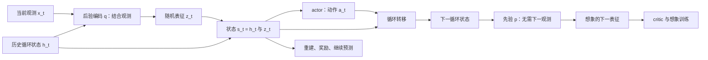

# Dreamer 路线：动力学如何服务于决策

## 路线总览

这条路线追问：**模型已经能够预测下一步，怎样让这种预测改善行动？** Dreamer 的答案是把环境经验压缩成可滚动的状态，在模型内生成未来，再用这些未来训练策略。世界模型负责“执行动作后可能出现什么”，价值模型负责“这些结果有多好”，策略负责选择动作；三者共同形成决策系统。[DreamerV3 原始论文](https://www.nature.com/articles/s41586-025-08744-2)、[Dreamer4 原始论文](https://arxiv.org/pdf/2509.24527v1)分别展示了在线交互学习和离线想象训练的实现。

这里的“想象”是模型生成的状态轨迹，不是 LLM 写出的推理文字。训练策略也不要求模型先恢复每一帧图像：解码器可以用于训练表征和检查预测，控制过程可以直接消费压缩状态。理解这条路线最有用的区分是：**世界模型的预测质量、模型内策略收益、真实环境中的执行收益，是三个需要分别验证的对象。**

### 总体机制

图中的模型内循环可以反复运行；真实执行仍要单独评估。V3 训练时继续采集环境经验，V4 的主要 Minecraft 实验使用固定离线数据，训练阶段没有图中的真实反馈回路。V3 部署时直接从 actor 采样动作，不进行在线前瞻搜索；“在模型里训练策略”与“每一步部署时搜索行动树”是不同实现。[V3，Learning algorithm / Critic learning](https://www.nature.com/articles/s41586-025-08744-2)、[V4，Algorithm 1 / §3.3 / §4.1](https://arxiv.org/pdf/2509.24527v1)。

| 要读懂的环节 | DreamerV3 | Dreamer4 |
| --- | --- | --- |
| 怎样表示当前状态 | 循环状态与离散随机表征，合称 RSSM 状态 | 按时间顺序约束的连续视频 token 与 transformer 上下文 |
| 怎样模拟未来 | 从潜在动力学先验滚动状态，预测奖励与继续标志 | 动作条件化 shortcut forcing，逐帧生成连续表征 |
| 怎样学行为 | 在想象轨迹上训练 actor / critic，持续在线收集数据 | 先行为克隆与奖励建模，再在固定世界模型内强化学习 |
| 最值得关注的证据 | 固定算法超参数跨多类任务的稳定性 | 离线想象训练能否超越行为克隆、精细交互能否实时模拟 |

这是沿同一个问题的机制变化，不能只按模型大小理解“V3 → V4”。V4 与生成式交互模拟路线重叠；预测表征可以作为动力学系统的组成部分；结构化动力学也可以接上价值模型或控制器。本站的四个入口组织的是研究问题，不是互斥的算法类别。

### 证据边界：哪里已经回答，哪里还没有

| 看到的证据 | 合理结论 | 仍需额外验证 |
| --- | --- | --- |
| 多步预测与原环境轨迹吻合 | 在相应数据分布及动作范围内，模型抓住了部分动力学 | 策略主动选择的新动作组合是否仍准确 |
| 想象训练优于同系统的行为克隆 | 模型生成的训练经验能改善该实验条件下的策略 | 改善是否跨环境、负载、故障与训练种子稳定 |
| 共享超参数在多域表现好 | 训练配方较稳健 | 同一个训练好的模型是否能直接迁移到新系统 |
| 输入动作后生成不同结果 | 模型具备动作条件化预测能力 | 干预效应是否可识别、混杂因素是否被控制 |

最后一行对 IT 场景尤其关键。历史运维动作往往由故障严重度、负载和操作者判断共同决定；训练得到的 `p(未来状态 | 历史, 动作)` 不会自动成为 `p(未来状态 | do(动作), 历史)`。这是一项迁移分析：Dreamer 的控制成绩没有代替生产系统中的干预识别与执行验证。

### 阅读顺序

1. 先读下方 **DreamerV3**：把 RSSM、观测更新、无观测滚动和 actor / critic 串成一个闭环。重点看 Nature 图 1 与 Learning algorithm。
2. 再读 **Dreamer4**：重点对照其算法 1、图 2、图 3 / 4 与表 3，理解训练方式、动作空间和数据条件一起改变了什么。
3. 若仍混淆“规划”与“学策略”，补读 [PlaNet：Learning Latent Dynamics for Planning from Pixels](https://arxiv.org/abs/1811.04551)与 [Dreamer：Dream to Control](https://arxiv.org/abs/1912.01603)，前者以潜在动力学规划为中心，后者转向用潜在想象训练行为。
4. 回到生成式交互模拟、预测表征、结构化动力学路线，比较它们把误差放在哪里衡量：像素、表征、物理状态、任务收益，还是安全约束。

## DreamerV3

把跨域稳定性做进世界模型训练。

**论文身份。** 预印本 *Mastering Diverse Domains through World Models* 首发于 2023 年 1 月 10 日；本站同时核查 arXiv v2（2024 年 4 月 17 日）与 Nature 正式版 *Mastering diverse control tasks through world models*（2025 年 4 月 2 日）。方法与实验解读以 Nature 正式版为主。“2025 Nature 论文”不意味着 DreamerV3 在 2025 年首次提出。[arXiv 版本记录](https://arxiv.org/abs/2301.04104)、[Nature 正式版](https://www.nature.com/articles/s41586-025-08744-2)。

### 它要解决的问题

模型式强化学习的困难不止是预测下一帧。观测尺度、奖励量级、动作类型、随机性与稀疏程度一变，重建、动力学、价值和策略损失的相对强度都可能失衡。DreamerV3 的主要贡献是让同一套训练配方在不同域保持有效；RSSM 与潜在想象的基本思想来自更早的 Dreamer 系列。阅读时应关注哪些稳定化手段支撑跨域结果，而不是把“世界模型 + RL”的组合本身当作全部创新。[Nature，Learning algorithm / Robust predictions](https://www.nature.com/articles/s41586-025-08744-2)。

### 机制：有观测时校正，没有观测时滚动

学习阶段，编码器把真实观测与历史状态结合，得到随机表征；动力学先验则仅靠历史与动作预测表征。预测与表征损失把两者拉近，同时用观测重建、奖励和继续标志保留有用信息。想象阶段不读取未来真实观测，而是由先验生成后续状态。actor 与 critic 在这些轨迹上学习，critic 通过自举回报估计想象窗口之外的收益。[Nature，图 1 / World model learning / Critic learning](https://www.nature.com/articles/s41586-025-08744-2)。

这也解释了模型为何不是“视频预测器外接一个策略”这么简单：表征必须同时可预测、含有控制相关信息，且误差不能在策略优化后失控。作者使用 KL balancing、free bits 与少量均匀分布混合稳定潜在学习；使用 symlog、symexp two-hot 表达跨尺度信号；再用回报分位数归一化平衡收益与探索。它们分别处理表征塌缩 / KL 尖峰、数值量级和策略目标尺度，不应被概括成一种泛泛的“归一化技巧”。[Nature，World model learning / Actor learning / Robust predictions](https://www.nature.com/articles/s41586-025-08744-2)。

### 训练数据与实验条件

V3 从在线交互收集观测、动作、奖励与终止信息，反复采样 replay buffer 并训练模型和策略。论文的跨域实验是**共享算法超参数、针对任务分别训练模型**，并非一个已经预训练好的模型同时掌握所有域。官方实现也以对应 task config 启动训练。[作者项目](https://danijar.com/project/dreamerv3/)、[官方代码与训练说明](https://github.com/danijar/dreamerv3)。

Nature 正式版覆盖八个域、超过 150 个任务，包含视觉和向量输入、离散和连续动作、密集和稀疏奖励；每个 Dreamer agent 使用一张 A100 训练。跨域汇总要结合预算看：DMLab 比较中的部分基线使用十倍交互数据；Atari100k 对 EfficientZero 的协议差异另作说明。不能把这些结果改写成“在任意任务、同等预算下都超过所有算法”。[Nature，Evaluation / Benchmarks / Methods，图 4](https://www.nature.com/articles/s41586-025-08744-2)。

Minecraft 实验不使用人类示范或自适应课程；动作空间包含抽象 crafting 动作，并加速破块。论文报告所有训练运行在一亿环境步内发现钻石，但“每次训练最终发现过”与“每个评估 episode 都成功”是两个指标。这里的环境接口也不同于 Dreamer4 的低层鼠标键盘操作。[Nature，Minecraft，图 5 / Extended Data Fig. 2](https://www.nature.com/articles/s41586-025-08744-2)。

### 主要发现该怎样读

图 4 支持的是训练配方在多类基准上的广度。图 6 的消融在 14 个任务上检查稳定化部件，并显示无监督重建信号对性能很重要；模型大小与 replay ratio 的扩展实验则主要在 Crafter 和一个 DMLab 任务上开展。它们提示扩大模型和增加训练更新能提升数据效率，但没有建立跨所有领域成立的通用 scaling law。[Nature，Ablations / Scaling properties，图 6](https://www.nature.com/articles/s41586-025-08744-2)。

### 局限与 IT 迁移

**泛化的单位是算法配方。** 固定超参数减少调参负担，但不会消除任务接口、奖励、动作与重置机制的设计工作。把论文写成“一个通用世界模型可直接接入云系统”超出了实验证据。

**可想象不等于可信。** 策略可能更频繁访问训练数据覆盖不足的状态，因而利用世界模型错误。在 IT 迁移中，应分别评估动作后指标预测、长轨迹误差和真实恢复收益；单步预测误差不能代替恢复成功率。这是机制分析，本文没有声称 V3 已在云运维中完成验证。

**数据应描述行动后的演化。** 可以把观测换成指标、日志、拓扑和配置，把动作换成扩缩容、限流或重启，把奖励换成恢复时间与资源成本；但需要保留动作时间、目标、完成状态及并发变化。公开 RCA 的根因标签只描述诊断目标，不能替代不同动作下的恢复轨迹。

**需要处理生产环境的额外条件。** 动作存在延迟与执行失败，负载和部署持续变化，系统也往往不可随意重置。合理的迁移起点是可控沙盒中的少量动作与真实反馈，再检查覆盖、漂移和不确定性；论文中的固定超参数与游戏成绩没有给出生产安全性保证。

### 建议精读顺序

先读图 1 和 World model learning，能解释“后验校正 / 先验滚动”；再读 Actor / Critic learning，解释“为什么短想象窗口仍能优化长期收益”；最后读图 4–6 和 Methods，把结果重新放回数据预算、接口与消融范围中。官方仓库是后续实验入口，本站只核验资料，没有运行作者代码，也没有声称复现。

## Dreamer4

从固定离线经验训练可执行行为。

**论文身份。** *Training Agents Inside of Scalable World Models*，Danijar Hafner、Wilson Yan、Timothy Lillicrap，arXiv:2509.24527v1，2025 年 9 月 29 日。本站读取 32 页原始 PDF；arXiv HTML 在后半部分存在转换缺失，图表和附录以 PDF 为准。[版本记录](https://arxiv.org/abs/2509.24527)、[原始 PDF](https://arxiv.org/pdf/2509.24527v1)、[作者项目](https://danijar.com/project/dreamer4/)。

### 它要解决的问题

生成视频的模型可以拥有很强视觉表现，却不一定能准确跟随连续操作，也未必快到足以训练策略。Dreamer4 同时追求三件事：压缩后的高容量动力学、少步数的逐帧交互生成，以及能超越示范行为的想象训练。它是 Dreamer 的控制目标与生成式交互模拟技术的交汇点，不应只当作 RSSM 的更大版本。[论文，§1–3](https://arxiv.org/html/2509.24527v1)。

### 机制：三阶段学习

**阶段一：建立可交互的动力学。** tokenizer 用 masked autoencoding 压缩视频，编码与解码都遵守时间顺序。这里的 causal 是时间注意力约束，不是因果效应识别。动力学 transformer 接收视频表征、动作、每帧噪声水平和采样步长，学习 shortcut forcing：将序列噪声训练与少步生成结合，在连续表征空间逐帧采样，默认每帧四次前向计算。空间 / 时间注意力分解、稀疏的长程时间层和 GQA 支撑效率。[论文，§3.1–3.2 / §3.4，图 2](https://arxiv.org/html/2509.24527v1)。

**阶段二：让模型理解任务与行为。** 加入 task token，通过策略头和奖励头学习行为克隆与奖励预测。task token 可以读取其他模态，但其他模态不能反向读取它，避免“想完成什么”直接改变动力学预测；未来变化仍应由动作驱动。这个架构限制减轻目标信息泄漏，不是对观测数据的因果识别定理。[论文，§3.3](https://arxiv.org/html/2509.24527v1)。

**阶段三：在模型内改进策略。** 从数据上下文启动想象轨迹，让策略和动力学交替生成动作与状态，以奖励头和价值头估计回报；主要设置冻结 transformer，只更新策略与价值头。PMPO 区分正、负优势来更新动作概率，并用行为先验约束策略偏移。行为先验能限制部分偏离，但不能保证离线模型在所有新轨迹上正确。[论文，Algorithm 1 / §3.3](https://arxiv.org/html/2509.24527v1)。

### 训练 / 数据：离线并不意味着没有监督

Minecraft 主要数据是 2,541 小时 VPT contractor gameplay，包含视频、鼠标键盘动作与事件标注；分辨率 360×640、帧率 20 FPS。任务与稀疏二值奖励由现有事件构造，共 20 个任务。评估时使用表 6 的线性任务提示序列引导走向钻石。作者还把均匀序列与任务相关序列各占一半：行为克隆用相关序列，动力学损失用均匀序列，防止只学成功片段而生成过度乐观的世界。[论文，§4 / §4.1，附录表 4–6](https://arxiv.org/pdf/2509.24527v1)。

“无需在线交互训练”应理解为：学习只依赖固定数据，最终策略仍在真实游戏环境中评估。它不意味着没有动作标签、奖励监督或任务分解。“只需少量动作数据”的实验是另一组动力学泛化实验，不能把其标签比例直接套到钻石成绩上。

计算成本也应分开看：论文训练模型总计约 2B 参数（tokenizer 400M、动力学 1.6B），使用 256–1,024 张 TPU-v5p；表 2 的完整模型在单张 H100 上达到 21.4 FPS。实时推理说明模型可被交互使用，并没有证明训练费用很低或普通设备具有相同速度。[论文，§4 / §4.4，表 2](https://arxiv.org/pdf/2509.24527v1)。

### 实际证据：把成绩和条件一起读

| 证据 | 原始结果与位置 | 可以支持什么 |
| --- | --- | --- |
| 离线钻石挑战 | 1,000 个随机世界、空背包、60 分钟 episode；钻石成功率 0.7%，铁镐 29.0%；§4.1、图 3、表 7 | 在固定离线数据条件下，想象训练最终可产生成功行为；长期成功率仍低 |
| 同系统行为消融 | WM+BC 的铁镐成功率 16.9%，完整 Dreamer4 为 29.0%；表 7、图 4 | 对照同一世界模型初始化，想象 RL 对后期里程碑有额外收益 |
| 少量动作标签 | 2,541 小时视频中给 100 小时动作标签，图 7 的归一化 PSNR 达 85%、SSIM 达 100%；§4.3 | 大量无动作视频可帮助动力学学习；这是预测指标，不是控制成功率 |
| 动作外推 | Nether / End 的视频在训练中可见，但动作标签被拿掉；§4.3、图 7 | 已通过无标签视频见过的场景，可接收从其他场景学到的动作条件化 |
| 人类模型内交互 | 16 个交互任务完成 14 个；§4.2、图 5、附录图 12–14 | 有能力模拟多种精细互动；没有证明完整 Minecraft 引擎等价性 |

上表数值均来自[原始 PDF](https://arxiv.org/pdf/2509.24527v1)。图 7 把“无动作训练”与“全部动作训练”作为归一化参照，85% 不等于 85% 的画面或干预被正确预测。Nether / End 实验也不是从未见过该场景的视频就直接迁移。

作者项目提供模型内交互视频，便于检查砖块放置、工具使用与界面操作。[官方展示](https://danijar.com/project/dreamer4/)。论文还用 SOAR 机器人数据展示动作条件化生成；附录 A.1 说明其 180 小时视频、7D 末端执行器相对动作与 5 FPS 的设置。该部分验证的是模型生成与交互，没有在本文中建立真实机器人策略执行的成功率结论。[论文，§4.2、图 6 / 附录 A.1](https://arxiv.org/pdf/2509.24527v1)。

### 局限：离线想象训练最难的部分仍在

**长期成功还很脆弱。** 0.7% 的钻石成功率是有价值的存在性证据，却离稳定完成长期任务有很大距离；它也提醒我们检查前期里程碑很好、末期组合失败的差异。在 IT 中，能恢复少数简单故障与稳定恢复长链故障是不同目标。

**短记忆与状态精度限制可用范围。** 作者明确指出模型还不是完整游戏克隆，主要限制包括短记忆和背包预测不精确；Minecraft 主要上下文仅 9.6 秒。推论上，跨长时间窗口保持配置、资源身份和异步作业状态，会是 IT 迁移的重要困难。[论文，§4.2 / §6](https://arxiv.org/pdf/2509.24527v1)。

**监督与任务安排贡献不可省略。** 事件奖励、相关片段筛选和预设提示链使离线数据中的学习信号更强；它并未展示无需人工任务定义就自主发现完整目标分解。V3 和 V4 的输入、动作与训练数据不同，表 3 专门列出这些差异；直接用两个版本的钻石成功率排名会混淆实验问题。[论文，§4.1 / §5，表 3–6](https://arxiv.org/pdf/2509.24527v1)。

**预测指标和交互展示覆盖不了策略风险。** FVD、PSNR、SSIM 衡量生成分布或图像相似性；短段高分不保证库存、动作前提和长期资源约束保持正确。表 2 使用连续叠加的设计消融，有利于展示整体效率提升，但不是每个部件的完整独立因子实验。这两点是对实验设计的分析，不是声称论文已观察到相应生产故障。

### 与 IT / 云系统的关系

可借鉴的是三阶段组织方式：先从广泛轨迹学习可预测状态，再用少量有明确动作和结果的数据校准控制语义，最后在模型内改进策略。对 IT 而言，“无动作视频”对应的启发是无完整操作标注的遥测历史；“有动作数据”对应准确记录的变更和执行轨迹。二者之间需要时间对齐与可观测性设计，不能只把现成游戏 token 换成日志文本就宣称迁移完成。

更适合的第一项验证是：在受控测试环境中，给模型相同历史与多个允许动作，检查其是否正确预测延迟、错误率、队列、资源成本和回滚结果，再比较策略执行收益。要特别覆盖失败操作与无效操作，避免只看成功案例。运维动作的观察关联、模型中的动作条件化、真实环境中的干预效果仍应分别报告；Dreamer4 的任务 token 隔离和生成能力不会自动解决混杂与未覆盖动作的问题。

### 建议精读顺序

先看算法 1 和图 2，还原三阶段；接着看图 3 / 4 和表 7，理解“优于 BC”究竟在哪些里程碑体现；再读图 7 的归一化定义、表 2 的计算条件、表 3 的设置差异；最后读附录任务提示链与 Discussion。本站核验了论文和官方展示，未独立运行训练、复现成功率或验证机器人控制。
