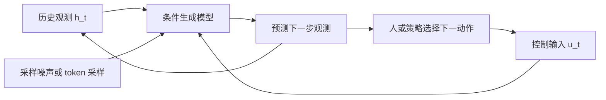
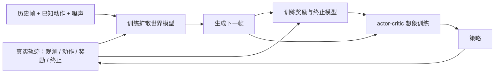
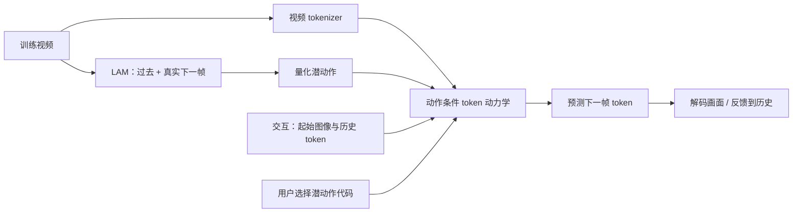

# 生成式交互模拟：让预测成为可交互的环境

> 本页按原始论文与官方项目核验，日期：2026-10-01。DIAMOND 采用 arXiv:2405.12399v2；Genie 采用 arXiv:2402.15391v1。本文为论文导读与研究分析，未独立复现论文实验。

## 路线总览

这条路线研究的问题是：模型能否根据历史观测与一个控制输入，连续生成下一步观测，供人或策略继续交互？视频生成提供了学习复杂观测分布的工具；逐步接收动作，再把预测反馈到下一步，才构成这里讨论的交互模拟。DIAMOND 使用记录在轨迹中的环境动作；Genie 从没有动作标签的视频中学习潜动作接口。二者分别说明“已知怎么操作时如何预测”与“只看到变化时如何发现控制接口”。[DIAMOND 官方机制说明](https://diamond-wm.github.io/)、[Genie 官方项目](https://sites.google.com/view/genie-2024/home)

总体机制可以写成 `历史 h_t + 控制 u_t → 下一步观测的条件分布 → 采样观测 → 更新历史 → 再次控制`。这里的控制输入可能是环境的真实动作，也可能是学到的离散代码；两者在部署时的语义约束不同。生成分布允许多个可能未来，却不会自动说明这些未来的概率已校准。

图是本站绘制的概念机制图。要读懂闭环，需区分两个层次：环境时间向前走一步，生成器可能在内部进行多次去噪或 token 更新。增加内部生成步骤可能改善观测质量，也会提高交互成本。

### 两种控制接口

| 要比较的点 | DIAMOND | Genie 2024 |
| --- | --- | --- |
| 控制输入如何获得 | 轨迹里已有的环境动作 | 相邻观测变化中学习的潜动作代码 |
| 下一步观测在哪里生成 | 扩散模型直接生成像素 | 动力学模型预测视频 token，再解码 |
| 决策证据应该怎么看 | 查看策略在真实 Atari 环境的回报 | 查看潜动作迁移和行为克隆实验 |
| 迁移时先确认什么 | 动作条件预测在新策略下是否仍有效 | 潜动作能否映射到真实、可执行操作 |

表格基于两篇论文的机制，旨在选择研究问题；它们不是互斥的算法类别。DIAMOND 同时属于动力学与决策研究，Genie 同时涉及预测表征和动作发现。生成模型也可以结合结构化状态或图动力学；“生成式”说明观测如何产生，并没有规定内部必须怎样表示系统。

### 实际证据怎样分层

第一层是观测质量：画面是否连贯，细节是否被保留。第二层是控制一致性：改变控制输入，是否得到有区别且稳定的变化。第三层是决策有效性：在模型里获得的策略或动作排序，回到真实环境是否仍有用。第四层才是可靠部署：未见状态、长时记忆、异常事件和约束违反如何处理。前一层通过，不能替后一层给出结论。

DIAMOND 提供 Atari 的真实环境回报，以及 CS:GO 的可交互演示；Genie 提供图像提示生成、潜动作一致性、生成指标与行为克隆迁移。应分别阅读对应实验，而不要把一段可玩的生成视频当作通用控制验证。[DIAMOND 论文 §4、§6](https://arxiv.org/html/2405.12399v2)、[Genie 论文 §3](https://arxiv.org/html/2402.15391v1)

### IT / 云系统迁移：先定义要忠实的量

以下是本站的迁移分析，不是论文已完成的 IT 实验。云系统的主要观测通常是指标、事件、拓扑、配置和日志；把它们画成逼真的仪表盘，并不能证明模型保存了容量、排队、依赖和故障传播关系。若研究目标是选择恢复操作，预测对象应至少包括延迟、错误率、资源状态、操作完成或失败，以及影响范围。

需要明确动作对象、参数、执行时刻、持续时间和实际执行结果。“扩容”不是一个无参数按钮；对不同服务、在不同负载下扩容，得到的后果可能不同。日志中的变化也可能来自自动控制器、流量变化或同时执行的其他操作。潜动作可以帮助发现行为模式，但必须额外建立代码与真实操作的映射，不能直接获得生产操作语义。

在这种场景中，`p(下一状态 | 历史, 动作)` 是条件预测目标；它不自动等于可识别的干预效应。只有观察到运维人员在高风险状态执行某动作，可能把动作和风险关联起来，却不能单凭这个关联判断执行动作的收益。可用受控测试环境或明确的干预假设检验动作效果，并在未见动作组合上报告误差与失败，而不是只报告平均预测损失。公开 RCA 根因标签可以帮助诊断评估，不能替代带动作与时间对齐的多步恢复轨迹。

### 阅读顺序

1. 先读本页的两种控制接口，再读 DIAMOND §2.3、§3 与 Figure 1，确定输入、生成位置和策略训练位置。
2. 读 DIAMOND Table 1、Figure 2 和 §6，区分真实回报、视觉分析与交互演示。
3. 读 Genie Figures 2、4、7，分别看训练时的潜动作推断与交互时的代码选择。
4. 读 Genie §3.3、Figure 14，再读 §5 与 Broader Impact，确认迁移实验和发布、算力限制。
5. 最后回到 IT 任务：画出可观测量、操作语义和验证环境，再决定是否需要生成完整观测，或只需预测与决策有关的状态。

## DIAMOND

重要细节怎样影响想象中的决策

**论文**：*Diffusion for World Modeling: Visual Details Matter in Atari*；Eloi Alonso 等；2024，NeurIPS Spotlight。首发 2024-05-20；本页读 2024-10-30 的 v2，区分其新增 CS:GO 部分。[论文版本记录](https://arxiv.org/abs/2405.12399)

### 问题与机制

DIAMOND 关心一个具体问题：压缩图像时失去的小细节，是否会损害策略学习？它把已知动作和过去画面作为条件，从噪声逐步生成下一帧；采用 EDM、U-Net 与短历史堆叠。奖励和终止由独立模型预测，actor-critic 在想象轨迹中训练，真实环境交互用于采集数据。[论文 §2.3–§3，Figure 1](https://arxiv.org/html/2405.12399v2)

这是依据 Figure 1、§3.2 绘制的流程图。学习下一帧和学习策略是两个任务：前者拟合环境观测，后者利用生成轨迹及奖励信号更新决策。真实交互预算被限制，并不意味着训练不耗计算。

从工程角度看，扩散世界模型有两种时间尺度：一帧内部需要若干次去噪，帧之间则自回归推进。去噪步数因此同时影响质量与策略训练成本。官方分析展示了单步生成在多种可能结果之间模糊化的情形；DIAMOND 的动力学采样采用 3 步。[官方项目 How does it work](https://diamond-wm.github.io/)

### 训练、数据与实验条件

Atari 100k 包含 26 个游戏，每个游戏允许 100k 环境动作，5 个随机种子；每次运行约耗一张 RTX 4090 的 2.9 天。Table 1 的平均 human-normalized score 为 1.459，IQM 为 0.641，11 个游戏超过人类基准。[论文 §4.1、Table 1、Figure 2](https://arxiv.org/html/2405.12399v2)

这组结果应连同逐游戏成绩阅读。平均 HNS 高于 1 说明汇总指标超过对应人类基准，不代表每个游戏都超过人类；IQM 与均值回答的分布问题也不同。若把它用于算法选型，应关心自己任务对应的失败尾部，而不仅是一个汇总数字。

CS:GO 模型使用固定的 87 小时训练数据，以较低分辨率预测动力学，再由另一扩散模型放大画面；官方项目报告约 10 FPS 的交互演示。这部分没有 RL 策略训练。[官方项目 Scaling to CS:GO](https://diamond-wm.github.io/)

### 主要发现与证据强度

Figure 5 在相同静态数据下与 IRIS 比较视觉细节；它有助于解释为何小目标的呈现会影响决策，但不是所有环境中“细节越多，策略越好”的普遍证明。§6 明确把 CS:GO 能力的定量测量留待未来，且注明该节在 NeurIPS 接收后加入。[论文 §5.3、Figure 5、§6](https://arxiv.org/html/2405.12399v2)

本文据此作出的判断是：Atari 结果支持这种生成模型作为特定策略学习管线的一部分；CS:GO 演示支持动作条件生成的可交互性。它们都没有证明同一个冻结模拟器能忠实承载任意新策略。策略改变访问状态的分布，可能把模型带入训练数据未覆盖的位置。

### 局限与 IT 关系

官方项目展示有限记忆与不充分动作覆盖导致的失败，包括本不允许的连续跳跃。[官方失败案例](https://diamond-wm.github.io/)

对 IT 迁移而言，这类错误尤其值得重视：模拟器若“允许”实际上不可执行的操作序列，策略可能利用错误得到虚构收益。需检验操作前置条件、资源不变量、失败与回滚，而不能仅要求预测曲线平滑。短历史也未必保留发布版本、未完成事务或慢故障积累。这个判断是迁移推论，论文没有在生产云系统上验证。

本页未运行 DIAMOND。官方代码提供预训练交互入口、训练配置和逐游戏逐种子结果，可作为后续实验入口；看过演示或查到代码都不构成独立复现。[官方代码与 README](https://github.com/eloialonso/diamond)

## Genie

从无动作标签的视频中学习控制接口

**论文**：*Genie: Generative Interactive Environments*；Jake Bruce 等；arXiv:2402.15391v1，2024-02-23。本页仅讨论 2024 论文；其证据不自动覆盖后续 Genie 产品。[原始版本](https://arxiv.org/abs/2402.15391v1)

### 问题与机制

Genie 面对的数据困难是：互联网上有大量视频，却通常没有逐帧动作记录。它用 latent action model 从过去帧和下一帧推断变化代码，视频 tokenizer 编码观测，动力学模型用代码与历史 token 预测下一帧。交互时，用户选择代码，无需提供真实下一帧。[论文 §2.1–§2.2，Figures 2、4、7](https://arxiv.org/html/2402.15391v1)

这是根据原论文绘制的训练与交互机制图。最容易误解的地方是训练阶段的“看见未来”：LAM 用真实下一帧获得学习信号；它不是一个部署时预知未来的控制器。生成时的代码是玩家输入。论文的 temporal causal mask 用于限制时间信息访问，不是因果识别的证明。

直观上，一个小代码集合迫使模型用有限接口解释变化。这个接口可以被人探索成“像某种方向移动”的按钮，却不保证每个代码都对应唯一真实动作。镜头移动、物体运动与操作者行为可能在视觉上产生相似变化；发现有用变化模式与识别真实操作原因是不同问题。

### 训练与数据

原论文用筛选后的约 30,000 小时 2D 平台游戏视频，训练帧为 160×90、10 FPS、16 帧序列；潜动作码本为 8。先训练 tokenizer，再训练 LAM 与动力学，后者以 token 交叉熵学习，采样使用 MaskGIT。整体模型约 11B 参数。[论文 §2–§3，附录 B–D](https://arxiv.org/html/2402.15391v1)

官方项目还展示了以真实照片、草图和合成图像启动交互，以及另行训练的 2.5B 机器人视频模型。文本提示的例子可以先经文本生成图像模型得到起始帧；不能把它理解成原论文所有模块都直接接收语言指令。[官方项目 A Foundation Model / The future of generative virtual worlds](https://sites.google.com/view/genie-2024/home)

### 实验条件与主要发现

§3 使用 FVD 与 ΔPSNR 衡量生成和控制，并在第 4 步测 ΔPSNR。CoinRun 的迁移实验将专家视频标成潜动作，训练行为克隆策略，再用少量真实专家动作样本映射到环境动作；Figure 14 报告 5 个种子，并有 200 样本适配的结果。[论文 §3、§3.3，Figure 14](https://arxiv.org/html/2402.15391v1)

这不是“只靠视频就完全免除操作标注”，也不是在 Genie 生成世界中训练通用 RL 策略的证据。它支持潜动作作为模仿迁移的中间接口。对于指标，ΔPSNR 能显示潜动作对生成有影响，但影响较大并不单独证明影响符合真实动作后果；FVD 衡量视频分布，也不能验证服务恢复、碰撞规则或操作约束。

官方项目明确将通用代理训练描述为潜在方向，并把迁移结果称为 proof of concept。读者应把“生成多样环境的愿景”与“已报告代理实验”分开评估。[官方项目 A stepping stone for generalist agents](https://sites.google.com/view/genie-2024/home)

### 局限与 IT 关系

v1 报告约 1 FPS、16 帧记忆以及不真实未来；Broader Impact 声明未随该论文发布训练检查点与数据。附录 F 给出小规模研究案例，本页未执行该案例或复现主模型。[论文 §5、Broader Impact、附录 F](https://arxiv.org/html/2402.15391v1)

对云系统，Genie 的启发是利用大量缺少操作标签的观测预训练变化表征；困难是把这种表示连接到明确的操作语义。若只从告警截图推断代码，代码可能表示“某区域变红”，而不是“重启某服务”。需要带时间、对象和参数的执行记录作语义锚定，并验证映射在不同拓扑和负载下是否稳定。

还需评估同样初始状态下替代操作的后果，而不能仅比较随机潜动作生成的视频。即使潜动作具有跨图像一致性，也没有给出干预可识别性、真实系统安全性或恢复成功率。本页把这些列为待验证问题，不作为 Genie 已完成的能力。

### 来源与后续使用

- [DIAMOND arXiv v2 正文](https://arxiv.org/html/2405.12399v2)：机制、Atari 条件与表格、CS:GO 实验范围、局限。
- [DIAMOND 官方项目](https://diamond-wm.github.io/)：机制可视化、交互演示与失败案例。
- [DIAMOND 官方代码](https://github.com/eloialonso/diamond)：实验入口与公开结果；本站未运行。
- [Genie arXiv v1 正文](https://arxiv.org/html/2402.15391v1)：训练与生成、指标、CoinRun、限制及发布说明。
- [Genie 2024 官方项目](https://sites.google.com/view/genie-2024/home)：提示方式、潜动作一致性、机器人生成与研究愿景。

逐条证据位置与核验状态保存在 `website/evidence/generative.json`。本站机制图为根据论文绘制的说明图，不是实验结果图。
